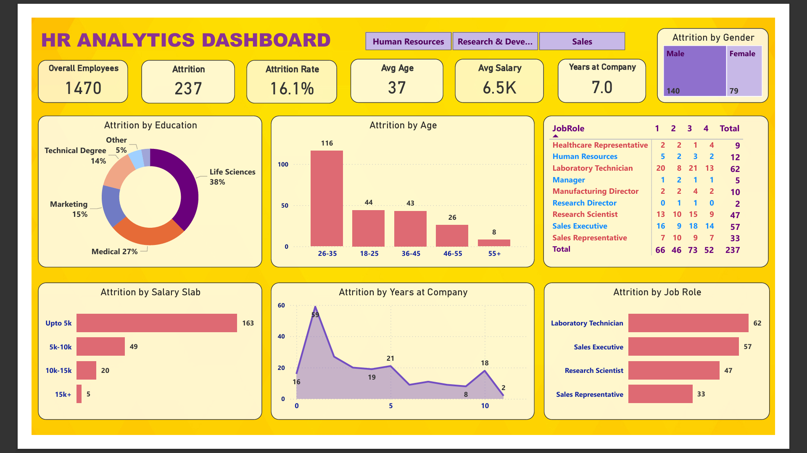
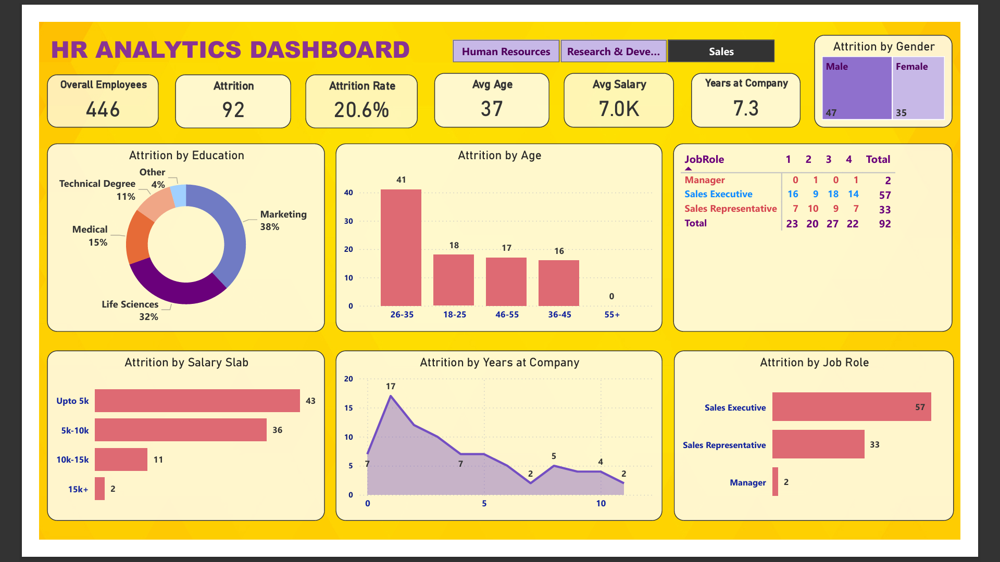

# HR Workforce Analytics Dashboard

## Project Overview

This Power BI dashboard analyzes employee attrition patterns and workforce trends using HR analytics data. The objective of the project is to identify factors contributing to employee turnover and provide actionable insights to support workforce planning and retention strategies.

The dashboard enables HR teams and business leaders to monitor employee demographics, attrition rates, salary distribution, job roles, and tenure-related trends through interactive visualizations.

---

## Business Problem

Employee attrition can increase recruitment costs, reduce productivity, and impact organizational performance. This project aims to answer important HR questions such as:

* Which departments experience the highest attrition?
* Which age groups are most likely to leave?
* How does salary impact employee retention?
* Which job roles have the highest turnover?
* How does employee tenure influence attrition?

---

## Key Insights

* Sales department experiences the highest employee attrition.
* Employees earning below 5K salary slabs show the highest turnover.
* Most employees leave within the first two years of employment.
* Employees aged 26–35 have the highest attrition rate.
* Laboratory Technicians and Sales Executives experience the highest turnover.
* Life Sciences and Medical educational backgrounds contribute significantly to attrition.

---

## Dashboard Features

### KPI Cards

* Total Employees
* Attrition Count
* Attrition Rate
* Average Age
* Average Salary
* Average Years at Company

### Interactive Analysis

* Attrition by Department
* Attrition by Education Field
* Attrition by Age Group
* Attrition by Salary Slab
* Attrition by Job Role
* Attrition by Gender
* Attrition by Years at Company

### Dynamic Filters

* Human Resources
* Research & Development
* Sales

---

## Data Cleaning and Preparation

The dataset was cleaned and prepared using Power Query with the following steps:

* Removed duplicate records
* Handled missing and null values
* Standardized categorical fields
* Corrected data types
* Created derived fields for analysis
* Validated data consistency and integrity

---

## DAX Measures Used

* Total Employees
* Attrition Count
* Attrition Rate
* Average Age
* Average Salary
* Average Years at Company

---

## Tools & Technologies

* Power BI
* Power Query
* DAX (Data Analysis Expressions)
* Microsoft Excel
* CSV Dataset

---

## Screenshots

### HR Dashboard Overview



### Attrition by Department



### Attrition by Salary Slab

.png)

---

## Repository Structure

```text
.
├── HR_Analytics_Dashboard.pbix
├── HR_Analytics.csv
├── hr-dashboard-overview.png
├── attrition-by-dept.png
├── attrition-by-salary(upto 5k).png
├── README.md
```

## How to Use

1. Clone or download this repository.
2. Open the `.pbix` file using Power BI Desktop.
3. Refresh the dataset if required.
4. Explore the dashboard using filters and interactive visualizations.

---

## Future Enhancements

* Predictive Employee Attrition Analysis using Machine Learning
* Employee Performance Analytics
* Recruitment Analytics Dashboard
* Diversity & Inclusion Metrics
* Employee Satisfaction Analysis

---

## Author

**Charan T R**

Data Analyst | Python | SQL | Power BI | Data Visualization

LinkedIn: https://www.linkedin.com/in/charan-t-r

GitHub: https://github.com/TRCharan
